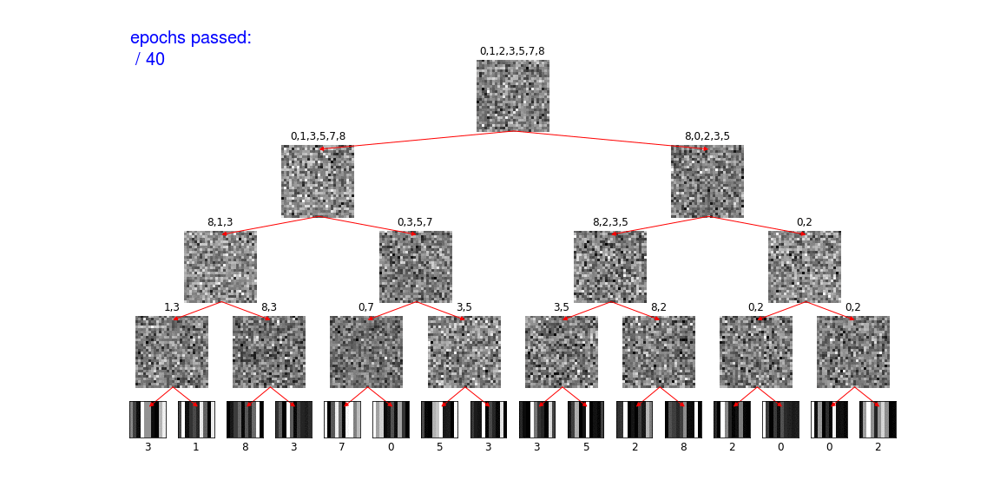
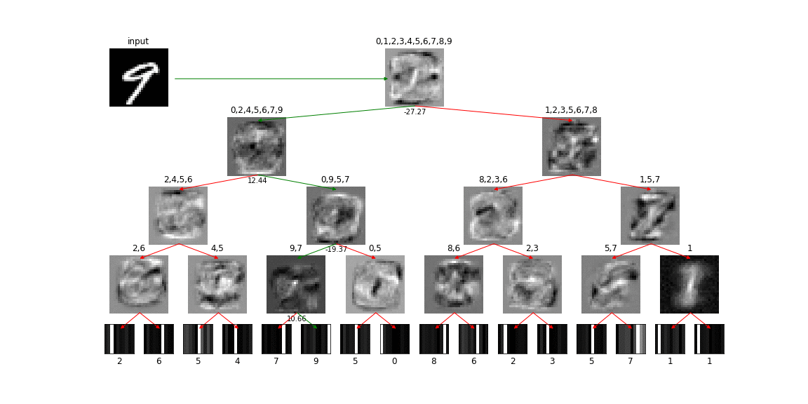

# The Hierarchical Mixture of Bigots
This is my implementation of an approach to neural network model interpretability issue described in the paper "[Distilling a Neural Network Into a Soft Decision Tree](https://arxiv.org/abs/1711.09784)" by _Nicholas Frosst_ and _Geoffrey Hinton_.



## Contents
My attempt to replicate the results reported in the [paper](https://arxiv.org/pdf/1711.09784.pdf) along with demonstration of how this implementation can be used on dataset [MNIST](http://yann.lecun.com/exdb/mnist/) for training NN model, distilling it into a Soft Binary Decision Tree (SBDT) model and visualizing it, can be found in [mnist.ipynb](mnist.ipynb).

Remaining content is documented by the table (and some of it also hopefully by itself).

| Location | Content description |
|---------|-----------------------------------------------------------------------------------------------------------------------------------------------------------------------------|
| [models/tree.py](models/tree.py)    | Implementation of SBDT model in `tf.keras` with all details as stated in the [paper](https://arxiv.org/pdf/1711.09784.pdf). Some parts such as loss regularization term calculation are done in pure TensorFlow. The rest is encapsulated into keras custom layers. |
|            | Due to lack of keras' flexibility, SBDT model is not save-able using keras' serialization methods so `tf.Saver` is used instead. This also means that keras callback for [ModelCheckpoint](https://keras.io/callbacks/#modelcheckpoint) won't work with this implementation (unless the model is re-written to avoid using `tf.Tensor` objects as keras `Layer` arguments). |
|            | Due to use of [moving averages](https://www.tensorflow.org/api_docs/python/tf/train/ExponentialMovingAverage) in calculation of penalty terms, custom two-step initialization of model parameters is required and model training (evaluation of `tree.loss` tensorflow graph op) is `batch_size`-dependent.  This also means, that `batch_size % train_data_size == 0` must hold, otherwise shape mismatch will be encountered at the end of training epoch (keras will feed the remainder as a smaller minibatch). |
| [models/convnet.py](models/convnet.py) | Implementation of basic convolutional NN model in `tf.keras` as given by keras [MNIST-CNN](https://github.com/keras-team/keras/blob/master/examples/mnist_cnn.py) basic example. |
| [models/utils.py](models/utils.py)   | Utility functions for re-setting tensorflow session and visualizing model parameters. |
| [makegif.sh](makegif.sh) | Converts directory of images into animation and labels frames based on folder name and file names. See [mnist.ipynb](./mnist.ipynb) for exemplary usage. |
| [assets](assets)    | Saved model checkpoints (for easier reproducibility) and illustrative images / animations.

## Requirements
Git Large File Storage ([git-lfs](https://git-lfs.github.com/)) is used to store model checkpoints and large gif animation files in the repo. To install it, run
```
git lfs install
```

Code was tested on [Python](https://www.python.org/) 3.5 with [TensorFlow](https://www.tensorflow.org/) version 1.10.0 and [matplotlib](https://matplotlib.org/) version 2.1.0.

To install the required python packages, run
```
pip3 install -r requirements.txt
```
For GPU support, use
```
pip3 install -r requirements_gpu.txt
```

## Results
The table below summarizes results as produced and presented in [mnist.ipynb](mnist.ipynb), but no exhaustive hyperparameter search was performed, so there is space for improvement.

| Model          | Depth | Labels | Batch size | Epochs | Accuracy |
|----------------|-------|--------|------------|--------|----------|
| ConvNet        | -     | hard   | 16         | 12     | 99.29%   |
| Tree (normal)  | 4     | hard   | 4          | 40     | 80.88%   |
| Tree (distill) | 4     | soft   | 4          | 40     | 90.71%   |

## Interpretability
Just a quick taste of what's inside. Detailed instructions of how to interprete these visualizations are in the [mnist.ipynb](mnist.ipynb) notebook.

### Inference



### Learning


